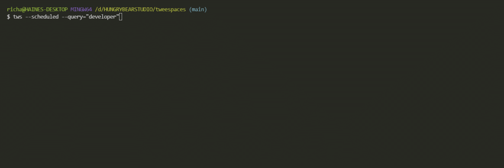

# 🐤 tweespaces

A node CLI for querying the Twitter spaces API.


## Installation

No need to install anything, just use `npx` 🕺

```bash
 npx tweespaces --live --query="developer"
```

## API Reference

There are 3 flags:

- `--live` - all spaces that are live now and match the query.
- `--scheduled` - all spaces that are scheduled to be run and match the query.
- `--query=""` - the keyword to query. This can be any text (including mentions and Hashtags).

### Show all live spaces with "developer" in the title

```bash
  npx tweespaces --live --query="developer"
```

### Show all scheduled spaces with "developer" in the title

```bash
  npx tweespaces --scheduled --query="developer"
```

## Result



## Author

- GitHub: [@molebox](https://www.github.com/molebox)
- Twitter: [@studio_hungry](https://twitter.com/studio_hungry)

